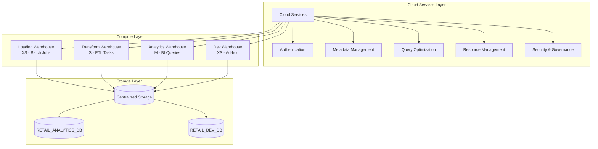
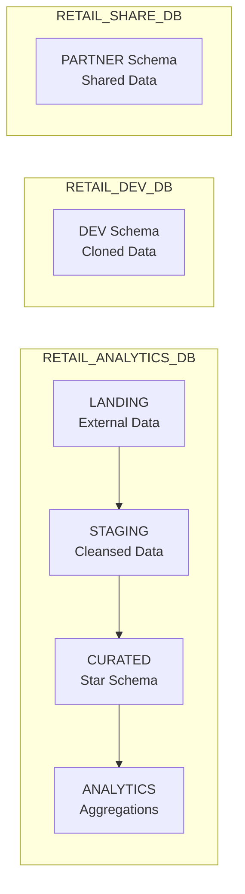

# Snowflake Architecture Deep Dive

## Overview

This document explains the Snowflake architecture as implemented in this retail analytics project.

---

## Snowflake's Three-Layer Architecture



---

## Layer Details

### 1. Cloud Services Layer

The "brain" of Snowflake - handles all metadata and coordination.

| Component | Function | Interview Relevance |
|-----------|----------|---------------------|
| **Metadata Store** | Tracks table structure, statistics, file locations | Enables zero-copy cloning, instant metadata queries |
| **Query Optimizer** | Parses, compiles, optimizes queries | Automatic query optimization, no manual tuning needed |
| **Security Manager** | Authentication, authorization, encryption | RBAC, masking policies, network policies |
| **Transaction Manager** | ACID compliance, versioning | Enables Time Travel, concurrent access |
| **Infrastructure Manager** | Provisions warehouses, manages resources | Auto-scaling, auto-suspend |

**Key Point**: Cloud Services is "always on" and charges credits only if usage exceeds 10% of daily warehouse usage.

### 2. Compute Layer (Virtual Warehouses)

Independent compute clusters that process queries.

```
Warehouse Sizing:

XS (1 node)    →  1 credit/hour   →  Simple queries, small loads
S  (2 nodes)   →  2 credits/hour  →  Moderate workloads
M  (4 nodes)   →  4 credits/hour  →  Complex transformations
L  (8 nodes)   →  8 credits/hour  →  Heavy analytics
XL (16 nodes)  →  16 credits/hour →  Large-scale processing
2XL (32 nodes) →  32 credits/hour →  Massive workloads
```

**Project Warehouses**:
```sql
-- Loading: Small, batch-oriented, can suspend quickly
CREATE WAREHOUSE LOADING_WH WITH
    WAREHOUSE_SIZE = 'XSMALL'
    AUTO_SUSPEND = 60
    AUTO_RESUME = TRUE
    INITIALLY_SUSPENDED = TRUE;

-- Transform: Larger, sustained workloads
CREATE WAREHOUSE TRANSFORM_WH WITH
    WAREHOUSE_SIZE = 'SMALL'
    AUTO_SUSPEND = 120
    AUTO_RESUME = TRUE;

-- Analytics: Larger for complex queries
CREATE WAREHOUSE ANALYTICS_WH WITH
    WAREHOUSE_SIZE = 'MEDIUM'
    AUTO_SUSPEND = 300
    AUTO_RESUME = TRUE;
```

**Key Concepts**:
- **Isolation**: Warehouses don't compete for resources
- **Elasticity**: Scale up (bigger) or scale out (multi-cluster)
- **Cost Control**: Auto-suspend saves credits when idle

### 3. Storage Layer

Centralized, columnar, compressed storage (micro-partitions).

```
┌─────────────────────────────────────────────────────────────────┐
│                     STORAGE ARCHITECTURE                         │
├─────────────────────────────────────────────────────────────────┤
│                                                                  │
│  ┌──────────────────────────────────────────────────────────┐   │
│  │                    TABLE: FACT_SALES                      │   │
│  │                    (100 million rows)                     │   │
│  └──────────────────────────────────────────────────────────┘   │
│           │              │              │              │         │
│           ▼              ▼              ▼              ▼         │
│    ┌──────────┐   ┌──────────┐   ┌──────────┐   ┌──────────┐   │
│    │  Micro-  │   │  Micro-  │   │  Micro-  │   │  Micro-  │   │
│    │ Partition│   │ Partition│   │ Partition│   │ Partition│   │
│    │    1     │   │    2     │   │    3     │   │   ...N   │   │
│    │ 50-500MB │   │ 50-500MB │   │ 50-500MB │   │ 50-500MB │   │
│    │ ~16M rows│   │ ~16M rows│   │ ~16M rows│   │ ~16M rows│   │
│    └──────────┘   └──────────┘   └──────────┘   └──────────┘   │
│           │              │              │              │         │
│           ▼              ▼              ▼              ▼         │
│    ┌──────────────────────────────────────────────────────────┐ │
│    │              METADATA (Cloud Services)                    │ │
│    │  - Min/Max values per column                             │ │
│    │  - Distinct count estimates                              │ │
│    │  - NULL count                                            │ │
│    │  - Physical file locations                               │ │
│    └──────────────────────────────────────────────────────────┘ │
│                                                                  │
└─────────────────────────────────────────────────────────────────┘
```

**Key Points**:
- **Micro-partitions**: 50-500MB compressed, ~16M rows each
- **Columnar**: Only read columns needed for query
- **Immutable**: Updates create new micro-partitions (enables Time Travel)
- **Automatic**: No manual partitioning required

---

## Project Database Architecture



### Schema Purposes

| Schema | Type | Purpose | Data Retention |
|--------|------|---------|----------------|
| **LANDING** | Transient | Raw data from S3, minimal transformation | 1 day |
| **STAGING** | Transient | Cleansed, validated data (ODS) | 1 day |
| **CURATED** | Permanent | Star schema (dimensions + facts) | 90 days |
| **ANALYTICS** | Permanent | Aggregations, materialized views | 90 days |

---

## Data Pipeline Architecture

### Batch Pipeline (Sales Data)

```
┌───────────┐    ┌───────────┐    ┌───────────┐    ┌───────────┐    ┌───────────┐
│   S3      │───▶│ External  │───▶│  STAGING  │───▶│  CURATED  │───▶│ ANALYTICS │
│ (CSV/JSON)│    │  Stage    │    │  (ODS)    │    │  (Star)   │    │  (Agg)    │
└───────────┘    └───────────┘    └───────────┘    └───────────┘    └───────────┘
      │               │                │                │                │
      │               │                │                │                │
      ▼               ▼                ▼                ▼                ▼
   Upload         List Files       COPY INTO      MERGE/INSERT    Refresh MVs
   to S3          via Stage        with Format    via Tasks       via Tasks
```

**Implementation Steps**:
1. Files land in S3 bucket
2. External Stage points to S3 location
3. COPY INTO loads data to staging tables
4. Streams capture changes in staging
5. Tasks process streams into curated layer
6. Materialized views refresh automatically

### Near Real-Time Pipeline (Clickstream)

```
┌───────────┐    ┌───────────┐    ┌───────────┐    ┌───────────┐    ┌───────────┐
│  Kinesis  │───▶│   S3      │───▶│ Snowpipe  │───▶│  STAGING  │───▶│  CURATED  │
│ (Stream)  │    │ (Landing) │    │ (Auto)    │    │  (Raw)    │    │  (Facts)  │
└───────────┘    └───────────┘    └───────────┘    └───────────┘    └───────────┘
      │               │                │                │                │
      │               │                │                │                │
   ~seconds        ~seconds         ~1 minute       Continuous       ~1 minute
   latency         to land          auto-ingest     streaming        task refresh
```

**Snowpipe Flow**:
1. Events stream to Kinesis
2. Kinesis Firehose writes to S3 (1-minute batches)
3. S3 event triggers SNS notification
4. SNS notifies Snowpipe SQS queue
5. Snowpipe auto-loads files (serverless)

---

## Virtual Warehouse Strategy

### Workload Segregation

```
┌─────────────────────────────────────────────────────────────────┐
│                    WAREHOUSE STRATEGY                            │
├─────────────────────────────────────────────────────────────────┤
│                                                                  │
│  BATCH LOADING          ETL TRANSFORM         ANALYTICS          │
│  ┌──────────┐           ┌──────────┐          ┌──────────┐      │
│  │LOADING_WH│           │TRANSFORM_│          │ANALYTICS_│      │
│  │  X-Small │           │   WH     │          │   WH     │      │
│  │ 1 credit │           │  Small   │          │  Medium  │      │
│  │ /hour    │           │ 2 credits│          │ 4 credits│      │
│  └──────────┘           └──────────┘          └──────────┘      │
│       │                      │                     │             │
│       ▼                      ▼                     ▼             │
│  • COPY INTO            • Tasks                • BI Tools        │
│  • Snowpipe             • Procedures           • Dashboards      │
│  • External tables      • MERGE/INSERT         • Ad-hoc queries  │
│                                                                  │
│  Schedule:              Schedule:              Usage:            │
│  Daily 2am-4am          Every 15 min           Business hours    │
│  Auto-suspend: 60s      Auto-suspend: 120s     Auto-suspend: 300s│
│                                                                  │
└─────────────────────────────────────────────────────────────────┘
```

### Multi-Cluster Warehouses (Scale-Out)

```sql
-- For high-concurrency analytics
CREATE WAREHOUSE ANALYTICS_WH WITH
    WAREHOUSE_SIZE = 'MEDIUM'
    MIN_CLUSTER_COUNT = 1
    MAX_CLUSTER_COUNT = 4
    SCALING_POLICY = 'STANDARD'  -- or 'ECONOMY'
    AUTO_SUSPEND = 300;
```

**Scaling Policies**:
- **STANDARD**: Immediately scales out when queries queue
- **ECONOMY**: Waits 6 minutes before scaling (saves credits)

---

## Caching Architecture

### Three Levels of Caching

```
┌─────────────────────────────────────────────────────────────────┐
│                     CACHING LAYERS                               │
├─────────────────────────────────────────────────────────────────┤
│                                                                  │
│  QUERY HITS CACHE?                                              │
│         │                                                        │
│         ▼                                                        │
│  ┌─────────────────┐                                            │
│  │  RESULT CACHE   │  ← 24-hour retention                       │
│  │  (Cloud Services│  ← Exact same query, same user role        │
│  │   Layer)        │  ← FREE - no compute used                  │
│  └────────┬────────┘                                            │
│           │ Miss                                                 │
│           ▼                                                      │
│  ┌─────────────────┐                                            │
│  │  WAREHOUSE      │  ← SSD cache on warehouse nodes            │
│  │  LOCAL DISK     │  ← Same warehouse must be running          │
│  │  CACHE          │  ← Faster than remote storage              │
│  └────────┬────────┘                                            │
│           │ Miss                                                 │
│           ▼                                                      │
│  ┌─────────────────┐                                            │
│  │  REMOTE STORAGE │  ← Full table scan from S3/Azure/GCS       │
│  │  (Cold)         │  ← Slowest, but always available           │
│  └─────────────────┘                                            │
│                                                                  │
└─────────────────────────────────────────────────────────────────┘
```

**Cache Invalidation**:
- Result cache: Invalidated when underlying data changes
- Warehouse cache: Lost when warehouse suspends
- Query modifications bypass result cache

---

## Security Architecture

### Defense in Depth

```
┌─────────────────────────────────────────────────────────────────┐
│                    SECURITY LAYERS                               │
├─────────────────────────────────────────────────────────────────┤
│                                                                  │
│  ┌─────────────────────────────────────────────────────────────┐│
│  │  NETWORK LAYER                                               ││
│  │  • Network Policies (IP allow/block lists)                  ││
│  │  • Private Link (AWS PrivateLink, Azure Private Link)       ││
│  │  • VPN connectivity                                          ││
│  └─────────────────────────────────────────────────────────────┘│
│                           │                                      │
│                           ▼                                      │
│  ┌─────────────────────────────────────────────────────────────┐│
│  │  AUTHENTICATION LAYER                                        ││
│  │  • Username/Password + MFA                                   ││
│  │  • SSO (SAML 2.0, OAuth)                                    ││
│  │  • Key Pair Authentication                                   ││
│  └─────────────────────────────────────────────────────────────┘│
│                           │                                      │
│                           ▼                                      │
│  ┌─────────────────────────────────────────────────────────────┐│
│  │  AUTHORIZATION LAYER (RBAC)                                  ││
│  │  • Role hierarchy (ACCOUNTADMIN → SYSADMIN → Custom)        ││
│  │  • Object privileges (SELECT, INSERT, etc.)                 ││
│  │  • Future grants                                             ││
│  └─────────────────────────────────────────────────────────────┘│
│                           │                                      │
│                           ▼                                      │
│  ┌─────────────────────────────────────────────────────────────┐│
│  │  DATA LAYER                                                  ││
│  │  • Row Access Policies (row-level security)                 ││
│  │  • Dynamic Data Masking (column-level security)             ││
│  │  • Secure Views (logic hidden)                               ││
│  └─────────────────────────────────────────────────────────────┘│
│                           │                                      │
│                           ▼                                      │
│  ┌─────────────────────────────────────────────────────────────┐│
│  │  ENCRYPTION LAYER                                            ││
│  │  • At-rest: AES-256 (automatic)                             ││
│  │  • In-transit: TLS 1.2                                       ││
│  │  • Customer-managed keys (Tri-Secret Secure)                ││
│  └─────────────────────────────────────────────────────────────┘│
│                                                                  │
└─────────────────────────────────────────────────────────────────┘
```

---

## Interview Tips - Architecture

### Common Questions

**Q1: Explain Snowflake's architecture advantages**
```
A: Three key advantages:
1. SEPARATION of storage and compute - scale independently
2. INSTANT ELASTICITY - warehouses spin up in seconds
3. ZERO MANAGEMENT - no tuning, indexing, vacuuming needed
```

**Q2: How does Snowflake achieve data sharing without copying?**
```
A: Snowflake shares METADATA, not data. The shared database
points to the same micro-partitions in storage. Consumer
uses their own compute to query, so no data movement occurs.
```

**Q3: What happens when you run a query?**
```
A:
1. Cloud Services parses and optimizes query
2. Checks result cache (return if hit)
3. Routes to virtual warehouse
4. Warehouse checks local cache
5. Reads required micro-partitions from storage
6. Executes query in parallel across nodes
7. Returns results and caches them
```

**Q4: How does auto-scaling work?**
```
A: Two types:
- SCALE UP: Increase warehouse size (more nodes)
- SCALE OUT: Multi-cluster warehouse (more clusters)

Scale out adds clusters when queries queue, removes them
when load decreases. STANDARD policy scales immediately,
ECONOMY policy waits to batch queries.
```

---

## References

- [Snowflake Documentation](https://docs.snowflake.com/)
- [Snowflake Architecture Whitepaper](https://www.snowflake.com/wp-content/uploads/2017/01/Snowflake-SIGMOD-2016.pdf)
- [Best Practices Guide](https://docs.snowflake.com/en/user-guide-best-practices.html)
